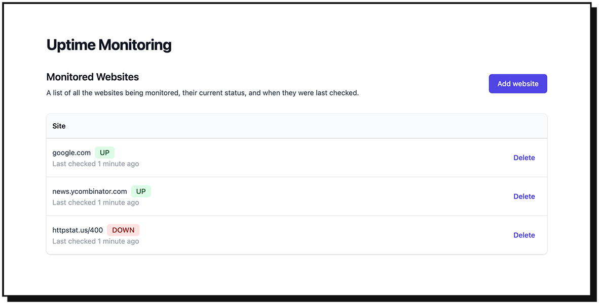

# Uptime Monitoring System

This is an Encore application that continuously monitors the uptime of a list of websites.

When it detects a website going down it posts a Slack message notifying that the website is down, and another message when the website is back up again.




This took about 4 hours to build from scratch, including tests using [Encore](https://encore.dev). It took 2 minutes to deploy, including databases, Pub/Sub topics, and cron jobs.

## Tutorial

Check out the [written tutorial (30 min)](https://encore.dev/docs/tutorials/uptime) to learn how to build this application from scratch!

## Install

You will need the [Encore CLI](https://encore.dev/docs/install)
to run and deploy this application.

To install Encore, run:
```bash
# macOS 
brew install encoredev/tap/encore

# Windows
iwr https://encore.dev/install.ps1 | iex

# Linux
curl -L https://encore.dev/install.sh | bash
```

Clone and run the app locally:
```bash
git clone git@github.com:encoredev/example-app-uptime.git
cd example-app-uptime

# Log in to Encore
encore auth login

# Set the Slack webhook secret (see tutorial above)
encore secret set SlackWebhookURL

# Run the app
encore run
```

## Using the API

```bash
# Check if a given site is up (defaults to 'https://' if left out)
$ curl 'http://localhost:4000/ping/google.com'

# Add a site to be automatically pinged every 5 minutes
curl 'http://localhost:4000/site' -d '{"url":"google.com"}'

# Check all tracked sites immediately
curl -X POST 'http://localhost:4000/checkall'

# Get the current status of all tracked sites
curl 'http://localhost:4000/sites'
```

## Deployment

```bash
encore app create my-oncall-app-name
git push origin main
```

Then head over to <https://app.encore.dev> to find out your production URL, and off you go into the clouds!

## Task

Task is used to list and run common development commands.

Install:
```shell
brew install go-task/tap/go-task
```

For other installation methods, see https://taskfile.dev/installation/

The Taskfile.yaml lists the commands available.
For example, you can run this command to run the task declared in that file called `gen`:
```shell
task gen
```

## Databases

### Creating a DB

Encore treats SQL databases as logical resources and natively supports **PostgreSQL** databases.

To create a database, import `encore.dev/storage/sqldb` and call `sqldb.NewDatabase`, assigning the result to a package-level variable.
Databases must be created from within an [Encore service](https://encore.dev/docs/primitives/services-and-apis).

You [define the schema](https://encore.dev/docs/primitives/databases#defining-a-database-schema) by creating a migration file. Encore takes care of [provisioning the database](https://encore.dev/docs/primitives/databases#provisioning-databases), running new schema migrations during deploys, and connecting to it.

### Connection String

#### Get Local
```shell
encore db conn-uri users --env=local
```

### DB interactions

### Shell

#### Open DB Shell

To open charities DB, local:
```shell
encore db shell charities --env=local
```

#### Re-running a migration
After opening a shell in the DB, run:
```shell
UPDATE schema_migrations SET version = version - 1;
```


#### Open DB Shell

To open charities DB, local:
```shell
encore db shell charities --env=local
```

#### Re-running a migration
After opening a shell in the DB, run:
```shell
UPDATE schema_migrations SET version = version - 1;
```

## Testing

```bash
encore test ./...
```

## Contributing

All contributions are welcome! All we ask is that you adhere to the [Code of Conduct](https://github.com/encoredev/encore/blob/main/CODE_OF_CONDUCT.md)

- [Quick Start with Encore](https://encore.dev/docs/quick-start)
- [Create an Account with Encore](https://encore.dev/login)
